# Diagrams

A comprehensive showcase of Mermaid.js diagram types.

## Flowchart

Workflows with different node shapes and connections.

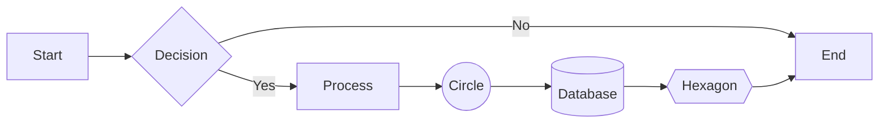

## Sequence Diagram

Interactions between actors over time.

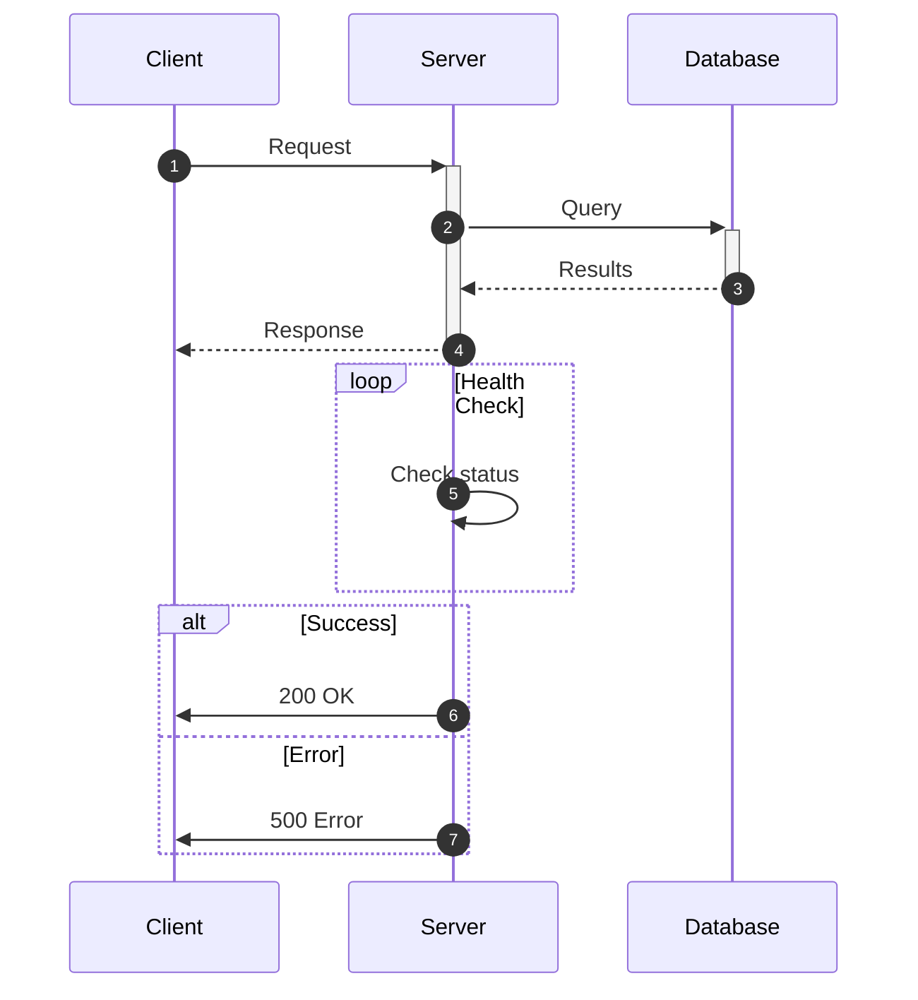

## Class Diagram

Object-oriented structure and relationships.

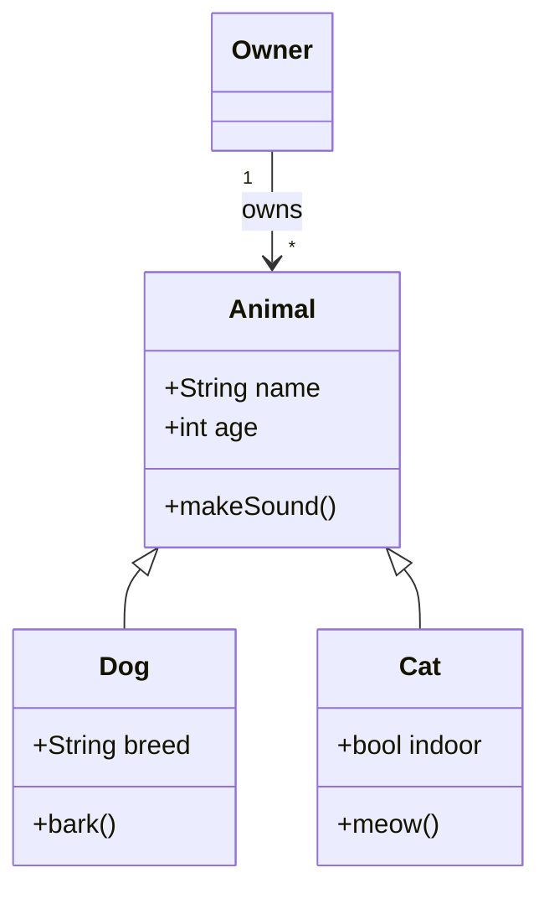

## State Diagram

System states and transitions.

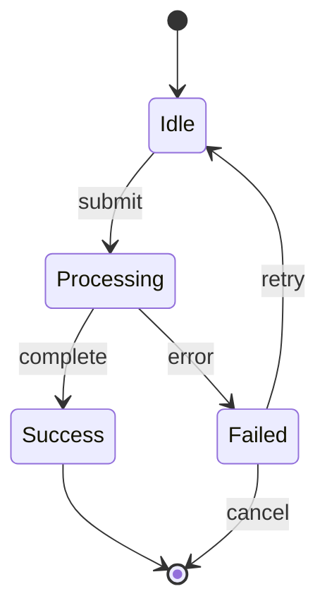

## Entity Relationship Diagram

Database schema and relationships.

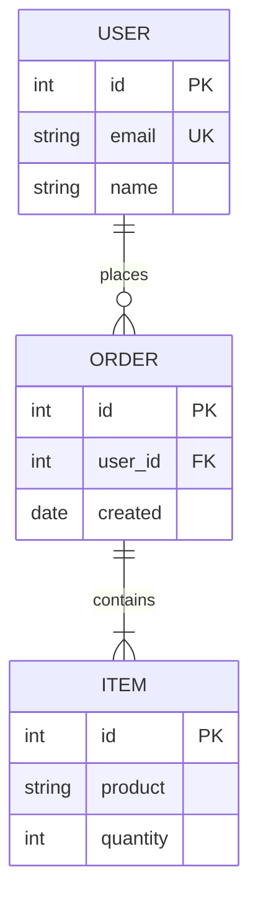

## User Journey

User experience mapping with satisfaction scores.

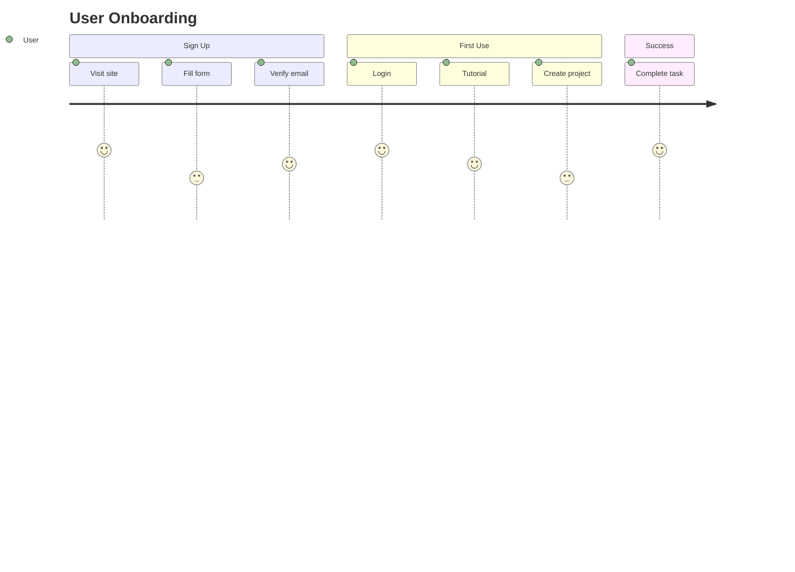

## Gantt Chart

Project schedules and dependencies.

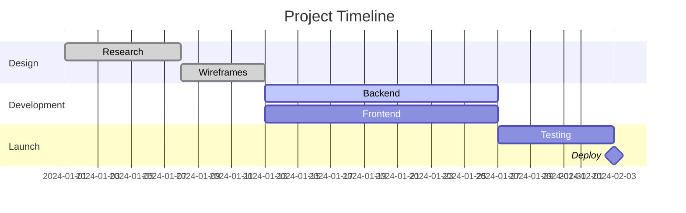

## Pie Chart

Proportional data distribution.

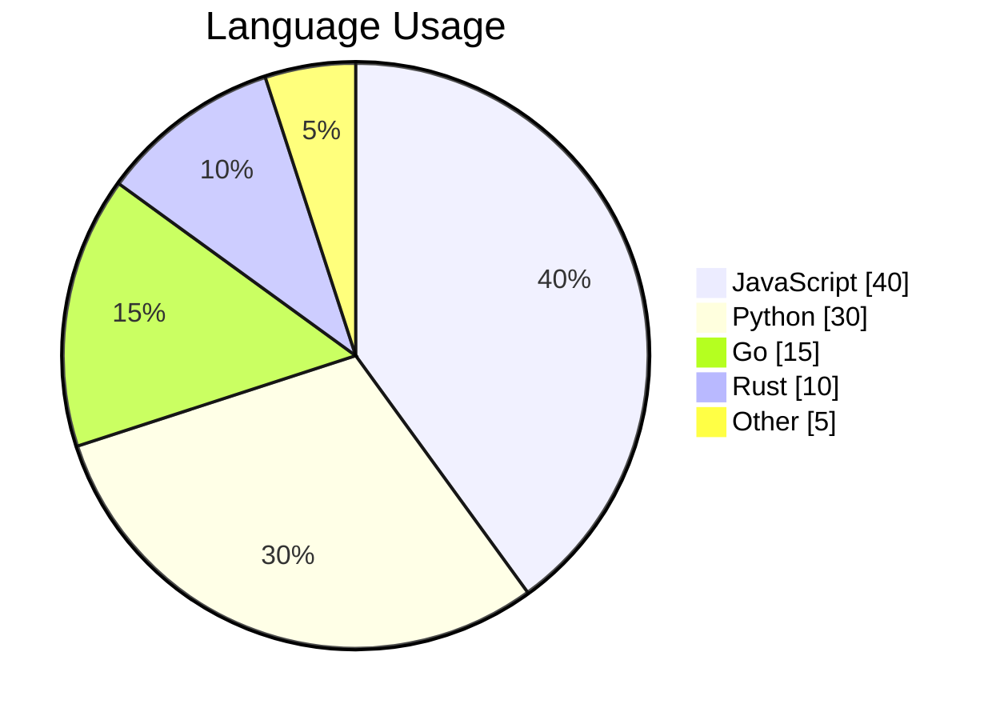

## Quadrant Chart

Two-dimensional analysis grid.

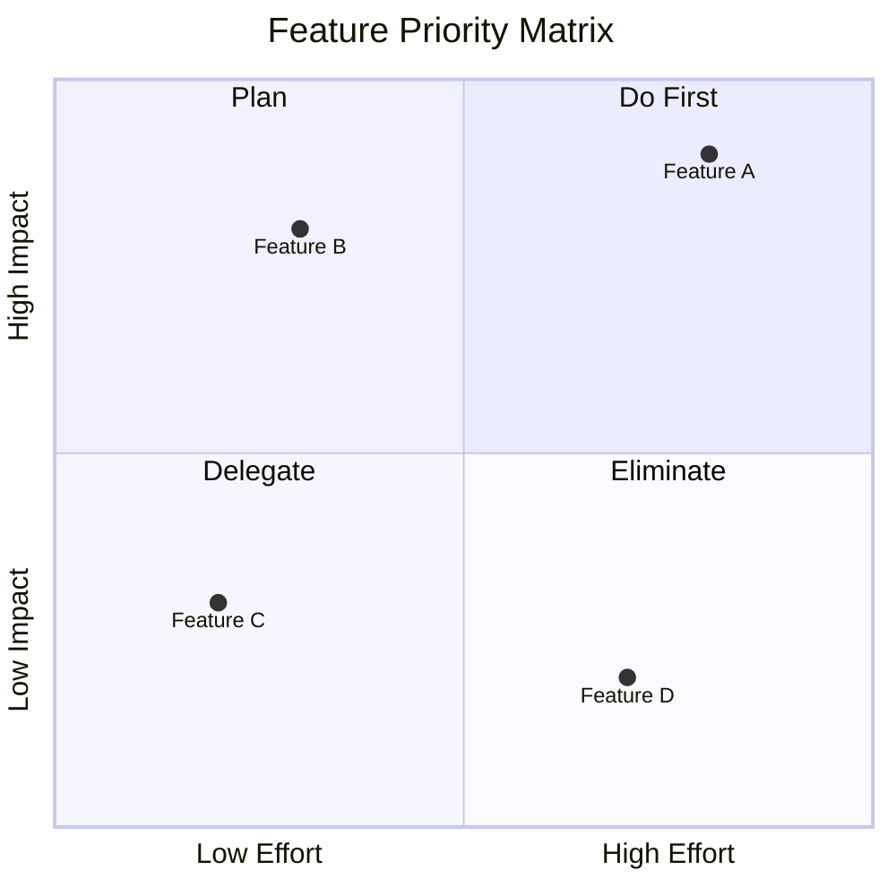

## Requirement Diagram

> **Note:** Requires Mermaid v11.1+

System requirements and traceability.

```mermaid
requirementDiagram
    requirement UserAuth {
        id: REQ-001
        text: System shall authenticate users
        risk: medium
        verifymethod: test
    }

    functionalRequirement Login {
        id: REQ-002
        text: Users can login with email/password
        risk: low
        verifymethod: demonstration
    }

    element AuthModule {
        type: module
        docref: auth.js
    }

    UserAuth - contains -> Login
    AuthModule - satisfies -> Login
```

## GitGraph Diagram

Version control branching and merging.

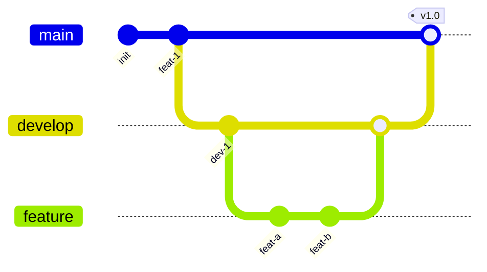

## C4 Diagram

Software architecture at different levels.

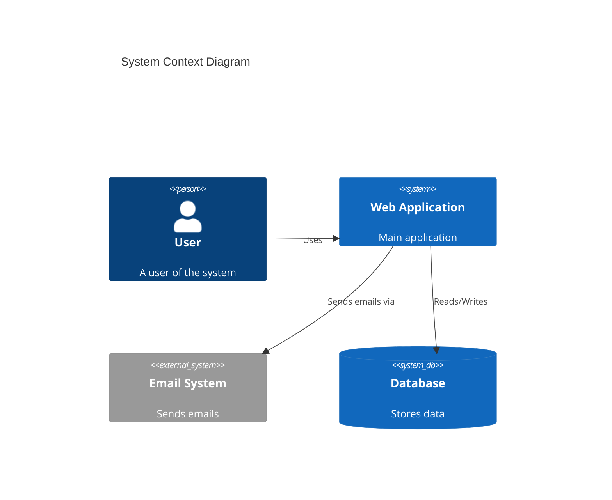

## Mindmap

Hierarchical idea organization.

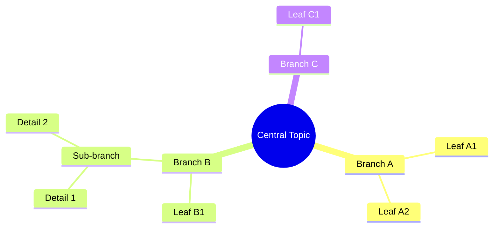

## Timeline

Chronological event display.

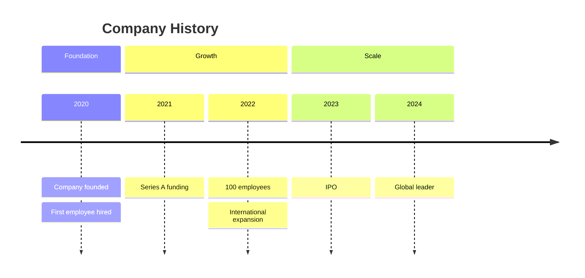

## ZenUML

> **Note:** Requires Mermaid v11.1+

Alternative sequence diagram syntax.

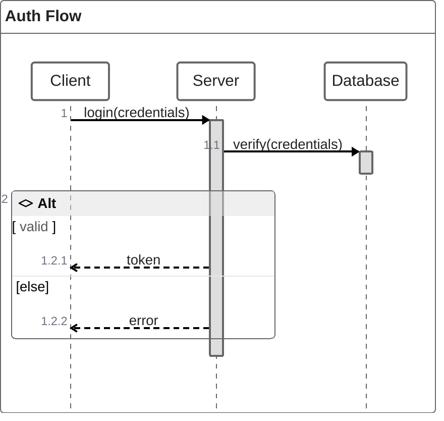

## Sankey Diagram

Flow and quantity visualization.

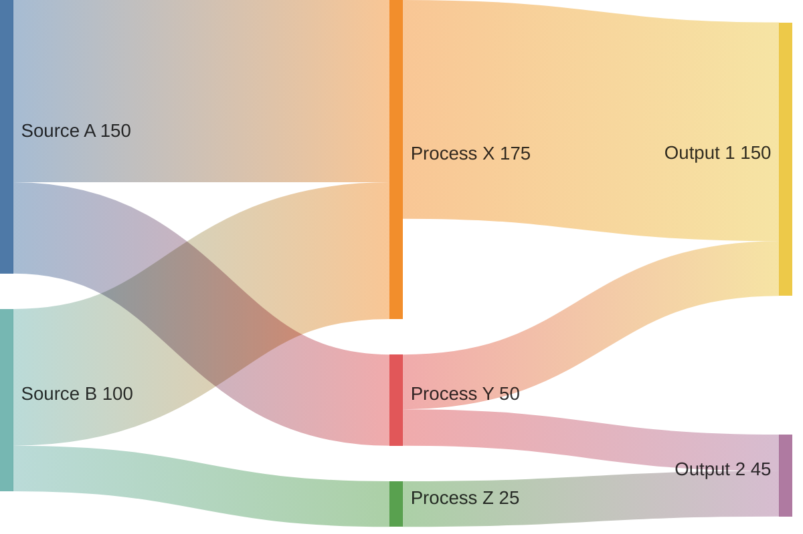

## XY Chart

Line and bar chart combinations.

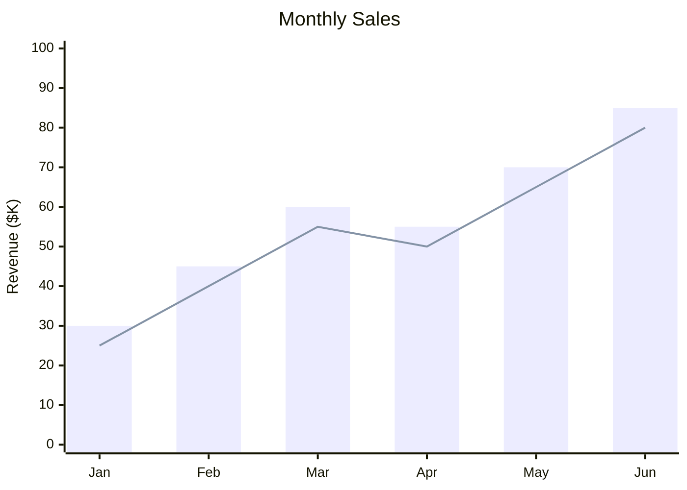

## Block Diagram

System component layouts.

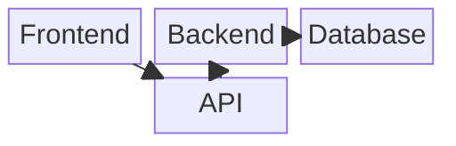

## Packet Diagram

Network packet structure.

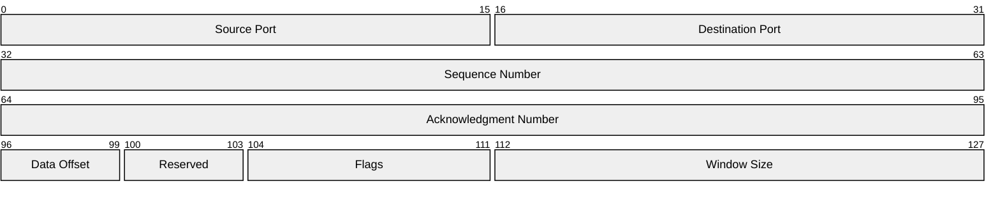

## Kanban Board

Task workflow visualization.

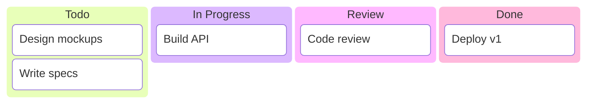

## Architecture Diagram

Cloud and infrastructure layout.

```mermaid
architecture-beta
    group cloud(cloud)[Cloud]

    service web(server)[Web Server] in cloud
    service api(server)[API Server] in cloud
    service db(database)[Database] in cloud

    web:R --> L:api
    api:R --> L:db
```

## Radar Chart

> **Note:** Requires Mermaid v11.1+

Multi-dimensional comparison.

```mermaid
radar-beta
    title Skill Assessment
    axis Design, Frontend, Backend, DevOps, Communication
    curve Developer A{4, 5, 3, 2, 4}
    curve Developer B{3, 3, 5, 4, 3}
    curve Developer C{5, 2, 2, 5, 5}
```

## Treemap

Hierarchical proportional display.

```mermaid
treemap-beta
    "Engineering"
        "Frontend": 40
        "Backend": 35
        "DevOps": 25
    "Product"
        "Design": 30
        "Management": 20
    "Operations"
        "Support": 15
        "HR": 10
```
